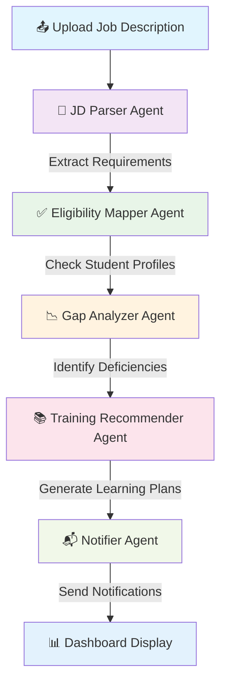

# 🧠 Eligibility & Training Tracker

### Agentic AI System for Dynamic Placement Readiness Evaluation

---

## 🎯 Overview

An intelligent agent-based AI system that automates the placement readiness evaluation process by:

- 📄 **Parsing job descriptions** to extract requirements
- 👥 **Evaluating student eligibility** against specific criteria
- 🔍 **Identifying skill gaps** and areas for improvement
- 📚 **Generating personalized learning plans** using RAG technology
- 📬 **Delivering automated email notifications** to students

This system streamlines placement readiness assessment in educational institutions using **LangGraph, Gemini AI, and Retrieval-Augmented Generation (RAG)**.

---

## 👤 Project Information

| Field              | Details                                       |
|-------------------|-----------------------------------------------|
| **Developer**     | Varadharajan                                  |
| **Project Title** | Eligibility & Training Tracker                |
| **Event**         | Final Hackathon – Agentic AI Training        |
| **Submission**    | ✅ Submitted before June 20, 2025, 5:30 PM IST |

---

## 🏗️ Project Architecture

```
eligibility-training-tracker/
├── backend/
│   ├── agents/                   # LangGraph agent implementations
│   │   ├── jd_parser.py
│   │   ├── eligibility_mapper.py
│   │   ├── gap_analyzer.py
│   │   ├── training_recommender.py
│   │   └── notifier.py
│   ├── chroma_db/               # ChromaDB vector store
│   ├── chroma_training_store/   # Training resources vector DB
│   ├── graph/                   # LangGraph orchestration logic
│   │   └── workflow.py
│   ├── utils/                   # Utility functions
│   │   ├── embeddings.py
│   │   ├── data_ingestion.py
│   │   └── database.py
│   ├── vector_db/               # Vector database configurations
│   └── main.py                  # FastAPI application entry point
├── frontend/
│   ├── src/
│   │   ├── components/          # React components
│   │   ├── pages/              # Application pages
│   │   └── utils/              # Frontend utilities
│   ├── package.json
│   └── public/
├── data/
│   ├── students.json           # Sample student profiles
│   └── jd_samples/            # Sample job description files
├── diagrams/
│   └── system_flow.png        # System architecture diagram
├── requirements.txt
├── package.json
└── README.md
```

---

## 🔄 System Workflow

The AI system operates through a structured **LangGraph pipeline** consisting of five specialized agents:



### Agent Workflow Details

1. **📄 Document Upload**: Job description files (PDF, DOCX, TXT) are uploaded
2. **🧾 JD Parser**: Extracts key requirements (CGPA, skills, experience)
3. **✅ Eligibility Mapper**: Evaluates students against extracted criteria
4. **📉 Gap Analyzer**: Identifies specific skill and qualification gaps
5. **📚 Training Recommender**: Uses RAG to suggest personalized learning resources
6. **📬 Notifier**: Sends customized training plans via email
7. **📊 Dashboard**: Displays comprehensive results and analytics

---

## 🤖 AI Agent Specifications

| Agent | Primary Function | Input | Output |
|-------|-----------------|-------|--------|
| **🧾 JD Parser** | Extract job requirements from uploaded documents | JD files (PDF/DOCX/TXT) | Structured requirement data |
| **✅ Eligibility Mapper** | Assess student qualification status | Student profiles + JD requirements | Eligibility classifications |
| **📉 Gap Analyzer** | Identify specific deficiencies | Student data + requirements | Detailed gap analysis |
| **📚 Training Recommender** | Generate personalized learning plans using RAG | Identified gaps + knowledge base | Customized training recommendations |
| **📬 Notifier** | Deliver automated communications | Training plans + student contacts | Email notifications |

---

## 🛠️ Technology Stack

### Core Technologies
| Layer | Technologies |
|-------|-------------|
| **Frontend** | React.js, Chart.js, Material-UI, Responsive Design |
| **Backend** | FastAPI, Python 3.9+, Async/Await |
| **AI Framework** | LangGraph, LangChain |
| **LLM** | Google Gemini 1.5 Flash (`langchain-google-genai`) |
| **Vector Database** | ChromaDB with Google Embeddings |
| **Database** | MongoDB (Student profiles and analytics) |
| **Communication** | SMTP Email Integration |

### Key Dependencies
```
langchain-google-genai
langgraph
chromadb
fastapi
pymongo
pandas
python-multipart
smtplib
```

---

## 🚀 Quick Start Guide

### Prerequisites
- Python 3.9 or higher
- Node.js 16+ and npm
- MongoDB instance (local or cloud)
- Google AI API key

### 🔧 Backend Setup

```bash
# Clone and navigate to backend
cd backend

# Create virtual environment
python -m venv venv
source venv/bin/activate  # Windows: venv\Scripts\activate

# Install dependencies
pip install -r requirements.txt

# Set environment variables
export GOOGLE_API_KEY="your_gemini_api_key"
export MONGODB_URI="your_mongodb_connection_string"

# Start the server
uvicorn main:app --reload --host 0.0.0.0 --port 8000
```

**Backend API Documentation**: [http://localhost:8000/docs](http://localhost:8000/docs)

### 💻 Frontend Setup

```bash
# Navigate to frontend directory
cd frontend

# Install dependencies
npm install

# Start development server
npm run dev
```

**Frontend Application**: [http://localhost:3000](http://localhost:3000)

---

## 📊 Dashboard Features

### Core Functionality
- **📤 File Upload**: Support for PDF, DOCX, and TXT job descriptions
- **✅ Eligibility Overview**: Real-time student qualification status
- **📉 Gap Analysis**: Detailed skill and requirement deficiencies
- **📚 Training Plans**: Personalized learning recommendations
- **📈 Analytics**: Interactive charts and statistical insights
- **🎨 Modern UI**: Dark theme with accessibility features

### Student Status Categories
- **🟢 Fully Eligible**: Meets all job requirements
- **🟡 Partially Eligible**: Minor gaps identified
- **🔴 Not Eligible**: Significant improvements needed

---

## 👥 Student Data Management

### Sample Student Profile Structure

```json
{
  "student_id": "S001",
  "name": "John Doe",
  "cgpa": 8.5,
  "skills": ["JavaScript", "React", "Node.js", "MongoDB", "Python"],
  "internships": 2,
  "projects": 5,
  "hackathons": 3,
  "certifications": ["AWS Cloud Practitioner", "Google Analytics"],
  "email": "john.doe@university.edu"
}
```

### Loading Student Data

```bash
# Prepare your students.json file
cd backend

# Execute data loading script
python utils/load_students_to_mongo.py

# Verify data insertion
python utils/verify_student_data.py
```

---

## 📤 Sample System Output

### Individual Student Assessment
```json
{
  "student_id": "S001",
  "name": "John Doe",
  "eligibility_status": "partially_eligible",
  "email": "john.doe@university.edu",
  "identified_gaps": [
    "Docker containerization",
    "Kubernetes orchestration", 
    "AWS cloud services",
    "Minimum CGPA requirement (8.0 vs 7.5)"
  ],
  "training_recommendations": {
    "Docker": [
      "Docker Official Tutorial",
      "Containerization Best Practices Course",
      "Hands-on Docker Projects"
    ],
    "AWS": [
      "AWS Cloud Practitioner Certification",
      "EC2 and S3 Fundamentals",
      "Serverless Architecture with Lambda"
    ]
  },
  "notification_sent": true,
  "timestamp": "2025-06-20T14:22:12.163633"
}
```

### System Analytics
```json
{
  "total_students_evaluated": 150,
  "eligibility_breakdown": {
    "fully_eligible": 45,
    "partially_eligible": 78,
    "not_eligible": 27
  },
  "common_skill_gaps": [
    "Cloud Computing (65%)",
    "DevOps Tools (58%)",
    "System Design (42%)",
    "Advanced Database Management (38%)"
  ],
  "processing_time": "2.3 seconds"
}
```

---

## 🔒 Ethics & Compliance

### Data Privacy
- **🔐 Secure Handling**: All student data is encrypted and securely processed
- **📧 Opt-out Options**: Students can unsubscribe from email notifications
- **🗑️ Data Retention**: Configurable data retention policies

### AI Transparency
- **💡 Explainable AI**: Clear reasoning behind recommendations
- **🎯 Bias Mitigation**: Regular model evaluation and adjustment
- **👨‍🏫 Human Oversight**: Designed to assist, not replace, placement officers

### Responsible AI Practices
- **✅ Fair Assessment**: Objective evaluation criteria
- **📊 Transparent Metrics**: Open methodology documentation
- **🔄 Continuous Improvement**: Regular system updates and refinements

---

## 🤝 Contributing

We welcome contributions! Please see our contributing guidelines:

1. Fork the repository
2. Create a feature branch (`git checkout -b feature/amazing-feature`)
3. Commit your changes (`git commit -m 'Add amazing feature'`)
4. Push to the branch (`git push origin feature/amazing-feature`)
5. Open a Pull Request

---

## 📄 License

This project is licensed under the MIT License - see the [LICENSE](LICENSE) file for details.

---

## 🙏 Acknowledgments

| Component | Attribution |
|-----------|-------------|
| **LangGraph** | LangChain Team - Agent orchestration framework |
| **Google Gemini** | Google AI - Large Language Model |
| **ChromaDB** | Chroma Team - Vector database solution |
| **FastAPI** | Sebastián Ramirez - Modern web framework |
| **React** | Meta - Frontend library |

---

## 📞 Support

For questions, issues, or contributions:

- **Developer**: Varadharajan
- **Project Repository**: [GitHub Link]
- **Documentation**: [Wiki Link]
- **Issues**: [GitHub Issues]

---

> *"Transforming placement readiness through intelligent automation and personalized learning pathways."* 
> 
> **— Varadharajan** 🚀

---

**Last Updated**: June 20, 2025
